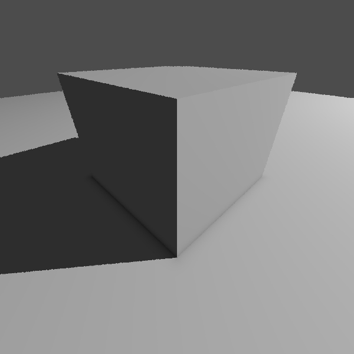
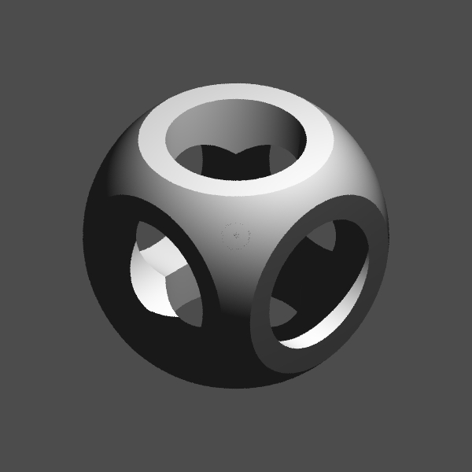

### Software ray marcher

|               Ambient occlusion and shadows               |                      Testing CSG system                      |
| :-------------------------------------------------------: | :----------------------------------------------------------: |
|  |  |

Small project to explore signed distance functions and constructive solid geometry. Runs on the CPU. Intended for educational purposes.

